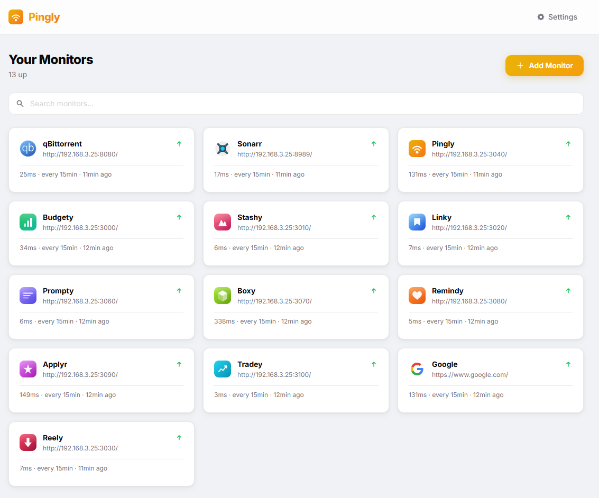

# Pulse



[](LICENSE)
[](https://hub.docker.com/r/larsmikki/pulse)
[](https://github.com/larsmikki/pulse/pkgs/container/pulse)
[](https://nodejs.org/)

**Pulse** is a self-hosted uptime monitor. Add URLs, set check intervals, and get an instant view of what's up and what's down — no accounts, no cloud, runs in a single Docker container.

## Features

- Monitor any HTTP/HTTPS URL with HEAD or GET requests
- Configurable check intervals from 1 minute to 24 hours
- Up/down/error status with response time display
- Down event alerts with dismiss support
- Per-monitor history log with status codes and response times
- Auto-fetched favicons for each monitored site
- Search and filter your monitors
- Enable or disable individual monitors
- Manual "check now" trigger per monitor
- Import and export monitors as JSON
- Bulk interval update across all monitors
- Log cleanup to trim old history
- Multiple built-in themes (light and dark)
- SQLite — no external database required

## Getting started

Pick whichever install path matches your setup. All paths land on [http://localhost:3040](http://localhost:3040).

### 1. Docker (Docker Desktop, NAS, or any Docker server)

Works on Synology, Unraid, TrueNAS, QNAP, Proxmox, or a plain Docker host.

```bash
docker run -d \
  --name pulse \
  -p 3040:3040 \
  -v pulse-data:/app/data \
  --restart unless-stopped \
  larsmikki/pulse:latest
```

Or with Compose:

```yaml
services:
  pulse:
    image: larsmikki/pulse:latest
    container_name: pulse
    ports:
      - "3040:3040"
    volumes:
      - pulse-data:/app/data
    restart: unless-stopped

volumes:
  pulse-data:
```

### 2. Local install on Windows

Requires [Git for Windows](https://git-scm.com/download/win) and [Node.js 20+](https://nodejs.org/).

```powershell
git clone https://github.com/larsmikki/pulse.git
cd pulse
npm install
npm run dev
```

For a production build: `npm run build && npm start`.

### 3. Local install on macOS

```bash
brew install node git
git clone https://github.com/larsmikki/pulse.git
cd pulse
npm install
npm run dev
```

For a production build: `npm run build && npm start`.

### 4. Local install on Linux

Debian/Ubuntu:

```bash
curl -fsSL https://deb.nodesource.com/setup_20.x | sudo -E bash -
sudo apt-get install -y nodejs git

git clone https://github.com/larsmikki/pulse.git
cd pulse
npm install
npm run dev
```

On Fedora/RHEL use `dnf install nodejs git`; on Arch use `pacman -S nodejs npm git`.

For a production build: `npm run build && npm start`.

## Configuration

| Variable | Default | Description |
|----------|---------|-------------|
| `PORT` | `3040` | Port the server listens on |
| `DATA_DIR` | `/app/data` | Directory for the SQLite database |

## Usage

| Action | How |
|--------|-----|
| Add a monitor | Click **Add Monitor** |
| Edit a monitor | Click the monitor card, then the edit icon |
| Pause a monitor | Toggle the enable switch in the edit dialog |
| Check immediately | Hover a card and click the refresh icon |
| Import monitors | **Settings → Import** |
| Export monitors | **Settings → Export** |
| Change theme | **Settings → Themes** |

## Data

All data is stored in a single SQLite file inside the Docker volume:

```
/app/data/
  data.db    # monitors, check logs, and settings
```

## Upgrade note (Pingr → Pulse)

The database filename (`data.db`) and localStorage theme key (`theme`) are brand-neutral, so
renaming the app does not reset application data or preferences when the same data directory is
used.

The Docker volume was renamed from `pingr-data` to `pulse-data`. If you have an existing
deployment, either keep the old volume name in your compose file, or copy the data directory
contents to the new volume before starting Pulse.

## License

[MIT](LICENSE)

## Support

If Pulse saves you time, consider [buying me a coffee](https://buymeacoffee.com/larsmikki) or [donating via PayPal](https://paypal.me/larsmikki). It helps keep the project free and maintained.
